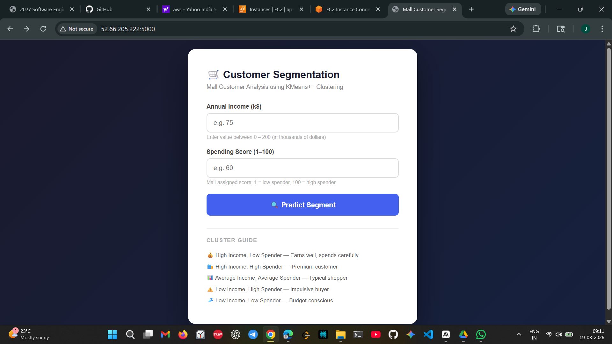
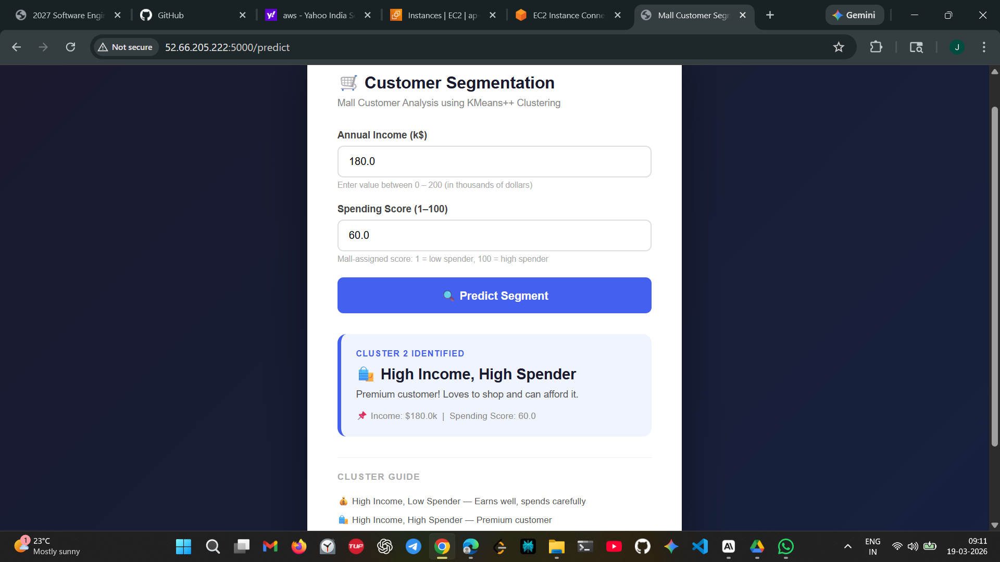

# 🛍️ Customer Segmentation using KMeans++

A machine learning web application that segments mall customers into behavioral clusters based on their **Annual Income** and **Spending Score**. Built with Python, Flask, and scikit-learn — deployed on **AWS EC2**.

---

## 🚀 Live Demo

> Previously deployed on AWS EC2 (t2.micro) — accessible via public IP on port 5000.  
> Redeployed on Render: **[Add your Render link here]**

---

## 📸 Screenshots

> **How to add screenshots:**
> 1. Take a screenshot of your app running (home page + prediction result)
> 2. Create an `assets/` folder in your GitHub repo
> 3. Upload the screenshots there
> 4. Replace the placeholders below with the actual paths

| Home Page | Prediction Result |
|-----------|------------------|
|  |  |

---

## 📌 Project Overview

Mall customers are segmented into **5 distinct behavioral clusters** using the **KMeans++ algorithm**. Given a customer's annual income and spending score, the app predicts which segment they belong to — useful for targeted marketing strategies.

| Cluster | Label | Description |
|---------|-------|-------------|
| 1 | 💰 High Income, Low Spender | Earns well but shops selectively |
| 2 | 🛍️ High Income, High Spender | Premium customer, loves to shop |
| 3 | 📊 Average Income, Average Spender | Typical middle-ground shopper |
| 4 | ⚠️ Low Income, High Spender | Impulsive buyer |
| 5 | 💤 Low Income, Low Spender | Budget-conscious shopper |

---

## 🧠 ML Model Details

- **Algorithm:** KMeans++ (`init="k-means++"`)
- **Dataset:** [Mall Customer Segmentation Dataset](https://www.kaggle.com/datasets/vjchoudhary7/customer-segmentation-tutorial-in-python)
- **Features used:** Annual Income (k$), Spending Score (1–100)
- **Number of clusters:** 5
- **Preprocessing:** StandardScaler (zero mean, unit variance)
- **Model persistence:** Saved as `model.pkl` and `scaler.pkl` using pickle

---

## 🛠️ Tech Stack

| Layer | Technology |
|-------|-----------|
| ML Model | scikit-learn (KMeans++) |
| Backend | Python, Flask |
| Frontend | HTML, CSS (Jinja2 templates) |
| Deployment | AWS EC2 (t2.micro), Render |
| Data | pandas, NumPy |

---

## 📁 Project Structure

```
customer-segmentation/
│
├── app.py                  # Flask app — routes and prediction logic
├── train_model.py          # Model training script
├── model.pkl               # Trained KMeans++ model
├── scaler.pkl              # Fitted StandardScaler
├── Mall_Customers.csv      # Dataset
├── requirements.txt        # Python dependencies
├── templates/
│   └── index.html          # Frontend UI
└── assets/                 # Screenshots (for README)
    ├── home.png
    └── prediction.png
```

---

## ⚙️ Run Locally

```bash
# 1. Clone the repository
git clone https://github.com/your-username/customer-segmentation.git
cd customer-segmentation

# 2. Install dependencies
pip install -r requirements.txt

# 3. Train the model (optional — model.pkl already included)
python train_model.py

# 4. Run the Flask app
python app.py
```

Visit `http://localhost:5000` in your browser.

---

## ☁️ AWS EC2 Deployment

The app was deployed on an **AWS EC2 t2.micro instance** (Ubuntu 22.04):

1. Launched EC2 instance and configured security group to allow inbound traffic on port **5000**
2. SSH'd into the instance and cloned the repository
3. Installed Python dependencies via `pip`
4. Ran the Flask app with `host="0.0.0.0"` to bind to the public IP
5. Accessed the app via `http://<EC2-Public-IP>:5000`

---

## 📊 Sample Prediction

**Input:**
- Annual Income: 80 k$
- Spending Score: 85

**Output:**
- Cluster: 🛍️ High Income, High Spender
- *"Premium customer! Loves to shop and can afford it."*

---

## 👤 Author

**Jigacharla Ajay**  
## 👤 Author

**Jigacharla Ajay**  
[LinkedIn](https://www.linkedin.com/in/jigacharla-ajay-71ba1834b/) • [GitHub](https://github.com/Jigacharla-Ajay) • [LeetCode](https://leetcode.com/u/Jigacharla_Ajay/)
